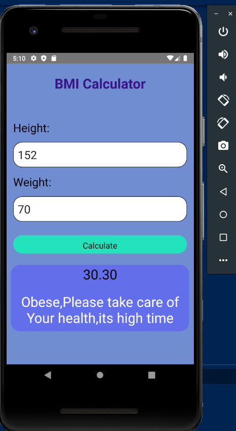
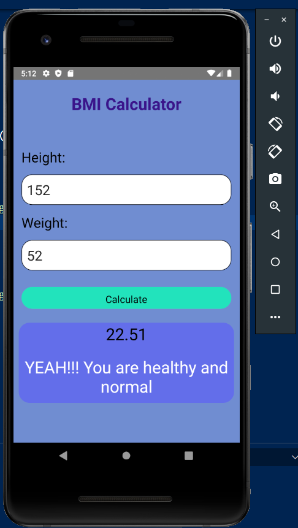
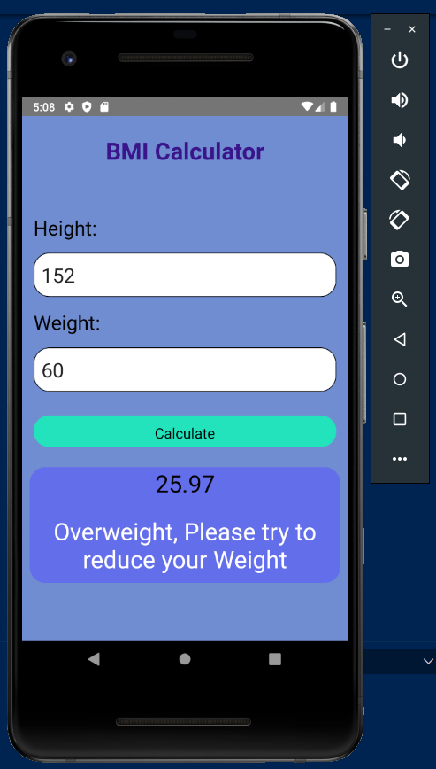
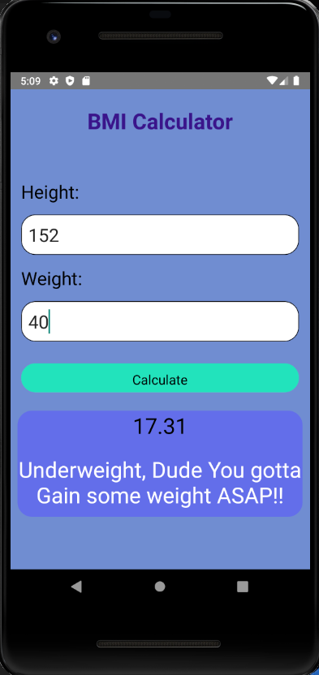

# BMI-Calculator

A basic BMI calculator Application using react-native

This App based application was developed to calculate the BMI (Body Mass Index) of a person using his/her height (cm) and weight (kg). This application is made using javaScript in react-native stack for frontend. The following images will shows the different screens of the app:

Go to command prompt.
In the project directory, you can run:

1. npm install
2. yarn install
3. react-native run-android

**Should have an emulator installed in the system

*Requirements :*

1. Android Studio and an emulator
2. VS code
3. Node.js set up is required.
